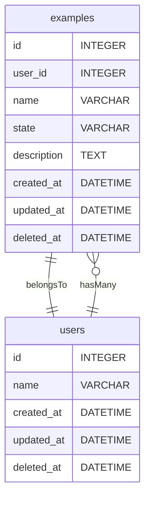

# Example Table Schema

```mermaid
erDiagram
    examples {
        id INTEGER
        user_id INTEGER
        name VARCHAR
        state VARCHAR
        description TEXT
        created_at DATETIME
        updated_at DATETIME
        deleted_at DATETIME
    }
    users {
        id INTEGER
        name VARCHAR
        created_at DATETIME
        updated_at DATETIME
        deleted_at DATETIME
    }
    examples ||--|| users : belongsTo
    users ||--o{ examples : hasMany
```
